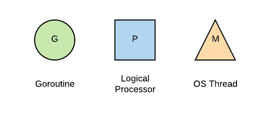

# Goroutines
## Basics
Before diving into goroutines, readers should have completed the concurrency section of Go Tour and
have a high level understanding of channels. Channels are the means for goroutines to communicate 
with each other. The famous Golang mantra is the following.

> Don't communicate by sharing memory; share memory by communicating

So What is a goroutine? The common definition is *a lightweight thread of execution*. We can create 
a goroutine easily using the `go` keyword.
```golang
func main() {
    ch := make(chan []byte)
    go func(recv chan int) {
        resp, _ := http.Get("https://example.com")
        defer resp.Body.Close()
        jsonBytes, _ := ioutil.ReadAll(res.Body)
        recv <- jsonBytes
    }(ch)

    fmt.Println("Program continues...")
    // Do other things

    // Then wait for HTTP response to come back
    result := <-ch
    fmt.Println("Done, result is", string(result))
}
```

With goroutine, we can make asynchronous network IO and continue the program without the need to 
wait for the response to come back. Obviously, network IO is just one of the many examples. We can
do parallelized processing like a mini map reduce and fully utilize each CPU core we have on our 
modern days machine. A typical Intel processsor has 4 cores at least. The high end models even have
8 or 16 cores.

## Goroutine Scheduler 
If we read carefully, we should know that goroutine is not an OS thread. It is an abstraction of a 
thread! You can call it an *application* thread. An OS thread is typically assigned with multiple 
goroutines. It is Go runtime's job to manage how many OS threads to create and how goroutines are 
mapped to and excuted on OS threads.

### G, M, P
Each goroutine is described by a [G][1] struct. The struct keeps track of various runtime 
information, like stack trace and status. There are three possible states for a goroutine.
* Waiting
* Runnable
* Executing

The struct [P][3] stands for *logical processor*. It can be seen as an abstract resource or context, 
which needs to be acquired. Every virtual core is given a logical processor when a Go program starts. 
Although a typical processor advertises itself with having 4 cores, hyperthreading would allow each 
core to have multiple hardware threads (different from OS level threads). 

Each hardware thread is presented as one virtual core. That means if I have 8 virtual cores and 8 
logical processor, I can execute 8 OS threads in parallel. You can check the number of virtual core 
by using `runtime` package.
```golang
package main

import (
    "fmt"
    "runtime"
)

func main() {
    fmt.Println(runtime.NumCPU())
}
```

[M][2] maps to an OS thread which can execute a **G** or goroutine. In order to execute **G**, Go 
runtime needs to assign assign **P** with a **M**. However M can be blocked or in system call without 
an associated P. We usually call **P** a context that is required for **M** to run a **G**. We can 
set the maximum number of OS thread that is going to be executed in parallel through
`runtime.GOMAXPROCS(int)`. By default, the variable is set to the number of cores you have on your 
CPU.
```golang
package main

import (
    "fmt"
    "runtime"
)

func main() {
	fmt.Println(runtime.GOMAXPROCS(1))
}
```

Here's the *important* thing, if you limit the maximum number of **P** to 1, it does not mean your Go 
program will ever spawn one OS thread. If an OS thread is blocked by IO or system calls, a new 
thread is going to be created and Go runtime will assign the new thread to your the one **P**. Now 
your **P** can continue to process all the other runnable **G**s. This is also why we need **P** 
because it holds the execution context. *Blocking thread != stop the world*.

I will use circle to represent **G**, square to represent **P** and triangle to represent **M**.


### Run Queue(s)
There are two types of run queue in Go scheduler. GRQ is the global run queue and LRQ is the local
run queue. Each logical processor **P** is given a LRQ which manages swapping goroutines on and off 
**M** that is assigned to the processor. GRQ is for goroutines that have not been assigned to a P yet.

Suppose we only have one **P** like I mentioned above. We can still create bunch of goroutines and they will get queued up to **P**'s LRQ.


### Blocked Thread
Now what if your **M1** is blocked by system call (e.g. fetch data from hard disk, wait for network
requests.) Go runtime will create a new OS thread!


### Work Sharing & Stealing

[1]: https://github.com/golang/go/blob/master/src/runtime/runtime2.go#L339
[2]: https://github.com/golang/go/blob/master/src/runtime/runtime2.go#L404
[3]: https://github.com/golang/go/blob/master/src/runtime/runtime2.go#L474