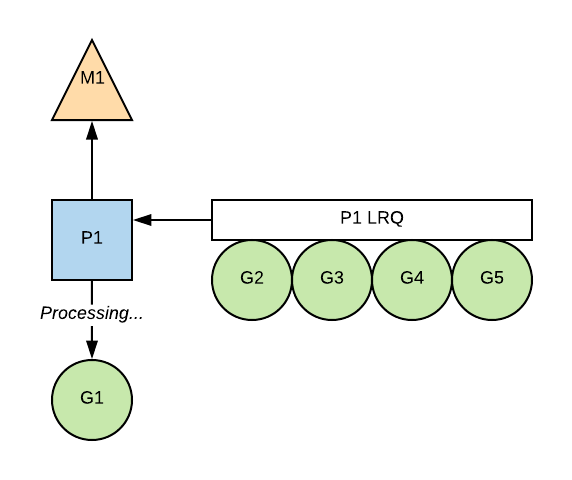
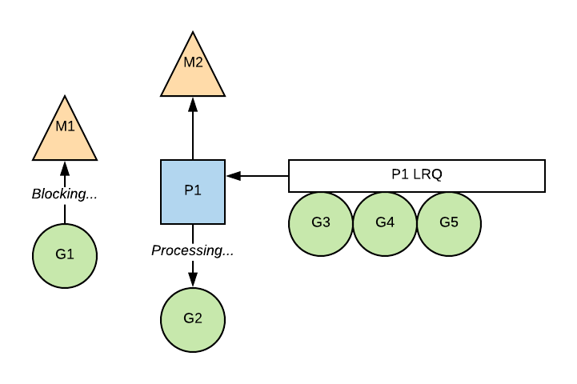

# Goroutines

## Basics

Before diving into goroutines, readers should have completed the concurrency section of Go Tour and
have a high level understanding of channels. Channels are the means for goroutines to communicate
with each other. The famous Golang mantra is the following.

> Don't communicate by sharing memory; share memory by communicating

So What is a goroutine? The common definition is *a lightweight thread of execution*. We can create
a goroutine easily using the `go` keyword.

```go
func main() {
    ch := make(chan []byte)
    go func(recv chan int) {
        resp, _ := http.Get("https://example.com")
        defer resp.Body.Close()
        jsonBytes, _ := ioutil.ReadAll(res.Body)
        recv <- jsonBytes
    }(ch)

    fmt.Println("Program continues...")
    // Do other things

    // Then wait for HTTP response to come back
    result := <-ch
    fmt.Println("Done, result is", string(result))
}
```

With goroutine, we can make asynchronous network IO and continue the program without the need to wait
for the response to come back. Obviously, network IO is just one of the many examples. We can do
parallelized processing like a mini map reduce and fully utilize each CPU core we have on our modern
days machine. A typical Intel processsor has 4 cores at least. The high end models even have 8 or 16
cores.

## Go Runtime

If we read carefully, we should know that goroutine is not an OS thread. It is an abstraction of a
thread! You can call it an *application* thread. An OS thread is typically assigned with multiple
goroutines. It is Go runtime's job to manage how many OS threads to create and how goroutines are
mapped to and excuted on OS threads.

### G, M, P

Each goroutine is described by a [G][1] struct. The struct keeps track of various runtime information,
like stack trace and status. There are three possible states for a goroutine.

- Waiting
- Runnable
- Executing

The struct [P][3] stands for *logical processor*. It can be seen as an abstract resource or context.
Although a typical processor advertises itself with having 4 cores, hyperthreading would allow each
core to have multiple hardware threads (different from OS level threads). Each hardware thread is
presented as one virtual core. That means if I have 8 virtual cores and 8 logical processor, I can
execute 8 OS threads in parallel. You can check the number of virtual core

by using `runtime` package.

```go
package main

import (
  "fmt"
  "runtime"
)

func main() {
  fmt.Println(runtime.NumCPU())
}
```

The struct [M][2] stands for machine, which maps to an OS thread which can execute a **G** or
goroutine. In order to execute **G**, Go runtime needs to assign assign **P** with a **M**. However
M can be blocked or in system call without an associated P. We usually call **P** a context that is
required for **M** to run a **G**.

We can set the maximum number of OS thread that is going to be executed in parallel through
`runtime.GOMAXPROCS(int)`. By default, the variable is set to the number of cores you have on your
CPU.

```go
package main

import (
  "fmt"
  "runtime"
)

func main() {
  fmt.Println(runtime.GOMAXPROCS(1))
}
```

Here's the *important* thing, if you limit the maximum number of **P** to 1, it does not mean your
Go program will ever spawn one OS thread. If an OS thread is blocked by IO or system calls, a new
thread is going to be created and Go runtime will assign the new thread to your the one **P**. Now
your **P** can continue to process all the other runnable **G**s. This is also why we need **P**
because it holds the execution context. *Blocking thread != stop the world*.

I will use circle to represent **G**, square to represent **P** and triangle to represent **M**.


## Go Scheduler

When a Go program starts, it is given a logical processor **P** for every virtual core. Every P is
assigned an OS thread **M**. Every Go program is also given an initial G which is the path of
execution for a Go program. OS threads are context-switched on and off a core, goroutines are
context-switched on and off a M.

There are two run queues in the Go scheduler.

- Global Run Queue (GRQ)
- Local Run Queue (LRQ)

Each P is given given a LRQ that manages the goroutines assigned to be executed within the context
of P. These goroutines take turn being context-switched on and off the M assigned to that P. GRQ
is for goroutines that have not been assigned to a P yet.



When a goroutine is performing an asynchronous system call, P can swap the G off M and put in a
different G for execution. However, when a goroutine is performing a synchronous system call, the
OS thread is effectively blocked. Go scheduler will create a new thread to continue servicing the
existing goroutines in the LRQ.



System calls involve switching user code to kernel code which includes accessing a hard disk drive,
creation and execution of a new process, communication with OS scheduler and etc...The nature of
a call being synchronous and asynchronous lies on OS implementation.

### Cooperative Scheduling

Go scheduler runs in user space, above the kernel. The current implementation of Go scheduler is not
a preemptive scheduler but a cooperative scheduler. Go scheduler requires well-defined user-space
events that occur at safe points in the code to context-switch from. Functional calls are critical
to the health of the Go scheduler. If you run any tight loops that are not making any function
calls, you will cause latencies within the scheduler and garbage collection.

There are four classes of events for scheduler to make scheduling decisions.

- Use of the keyword `go`
- Garbage collection
- System calls
- Synchronization and orchestration e.g. `mutex`

Garbage collection runs its own set of goroutines. If a goroutine makes a system call that will
cause the goroutine to block the M, sometimes the scheduler is capable of context switching the
goroutine off the M and context-switch a new goroutine onto that M. However, sometimes a new M is
required to keep executing goroutines that are queued up in the P, as explained above.

### Work Stealing

The last thing you want is an M to move into a waiting state, because once that happens, the OS will
context-switch the M off the core. This means that P can't get any work done even if there is a
goroutine in a runnable state. When a P finishes its LRQ very quickly, it needs to perform a work
stealing to prevent M entering a waiting state.

```text
var found bool

check global run queue once every 61 times

if goroutine not found
  check local run queue

if still not found
  steal from other logical processors

if still not found
  check global run queue

if still not found
  poll network
```

## Performance

The major difference between threads and goroutines is context switch cost. In the case of using
goroutines, the same OS thread and CPU core is being used for all the processing or message bouncing
between two goroutines. From the OS perspective, the OS thread never moves into a waiting state, not
once.

Essentially, Go has turned I/O blocking work into CPU bound work at OS level. Since all context
switching is happening at the application level, we don't lose the same 600 instructions per context
switch that we were losing when using threads. Go scheduler attempts to use less threads and do more
on each thread.

[1]: https://github.com/golang/go/blob/master/src/runtime/runtime2.go#L339
[2]: https://github.com/golang/go/blob/master/src/runtime/runtime2.go#L404
[3]: https://github.com/golang/go/blob/master/src/runtime/runtime2.go#L474
