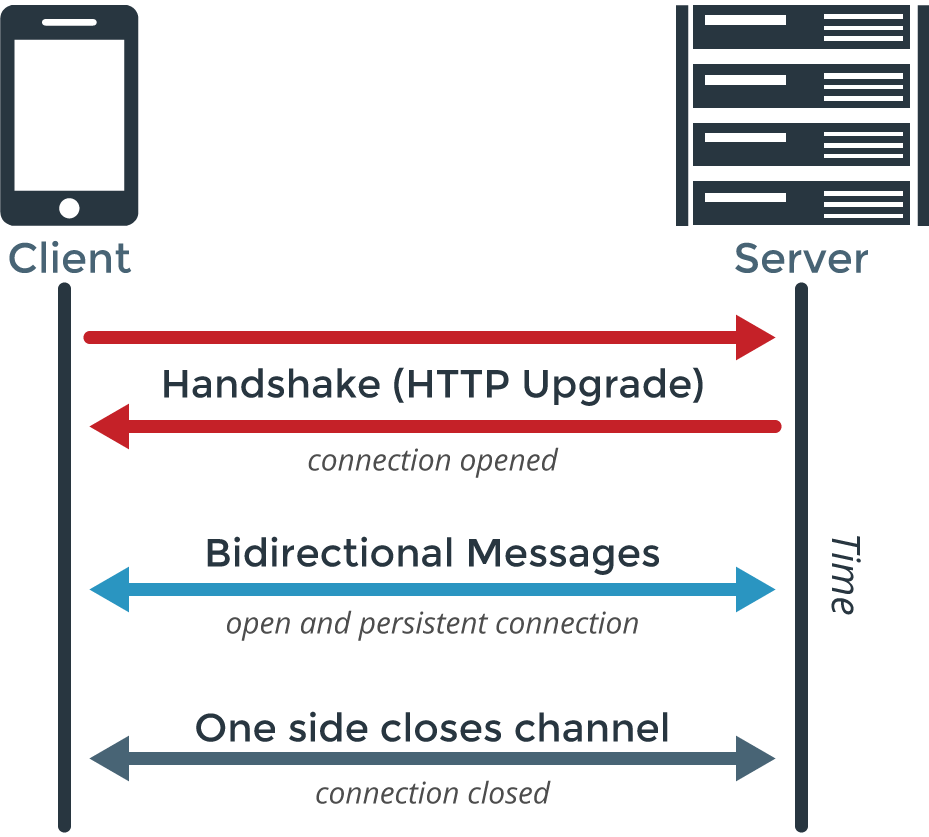

# WebSocket Handlers

Here's a quick refresh for those who are not familiar with WebSocket. *Quoted directly from RFC 6455*.

> The WebSocket Protocol enables two-way communication between a client running untrusted code in a
> controlled environment to a remote host that has opted-in to communications from that code.

Basically, it allows two way communication between client and server. WebSocket is implemented over
TCP connection. A typical HTTP/1.1 request/response cycle involves 3 way handshake to establish a TCP
connection and then uses this connection to send a request and receive a response. After a response
is received, the connection will be terminated. However, there is a keep-alive option for HTTP header
to keep the connection alive and allow multiple request/response to send across the same TCP connection.

For websocket, we want to hijack this TCP connection and use it like we are talking on a phone with
someone, so that we can send whatever we want and whenever we want. The act of hijacking is also
called *upgrading*.



## Gorilla WebSocket

Implementing the WebSocket Protocol from scratch involves quite a bit work, so we should default to
use existing open source library to do the work for us. A popular choice is
[gorilla](https://github.com/gorilla/websocket).

Here's how it works. Each WebSocket connection begins with a GET request to the server. We will take
the request and **upgrade** the connection to a websocket connection.

```go
var upgrader = *websocket.Upgrader{}

func WebsocketHandler(w http.ResponseWriter, r *http.Request) {
    conn, err := upgrader.Upgrade(w, r, nil)
    if err != nil {
        return
    }

    defer conn.Close()

    for {
        var err error
        var data []byte

        data, err = conn.Read()
        if err != nil {
            return
        }

        // Echo the message back
        err = conn.Write(data)
        if err != nil {
            return
        }
    }
}
```

After we upgraded the connection, we receive a WebSocket connection `websocket.Conn` which internally
has a TCP connection. The upgrader is *hijacking* a TCP connection from the response writer. This is
evident when we take a look at the source code from
[gorilla](https://github.com/gorilla/websocket/blob/master/server.go#L178).

```go
h, ok := w.(http.Hijacker)
if !ok {
    return u.returnError(w, r, http.StatusInternalServerError,
        "websocket: response does not implement http.Hijacker")
}

var brw *bufio.ReadWriter
netConn, brw, err := h.Hijack()
if err != nil {
    return u.returnError(w, r, http.StatusInternalServerError, err.Error())
}
```

The response writer implements a `Hijacker` interface which allows HTTP handler to take over the
connection. The `netConn` is in fact a `net.TCPConn` which implements the `net.Conn` interface.