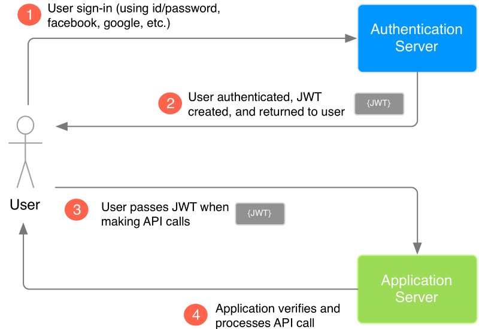

# Build User Authentication

## Postgres Setup

I am going to use PostgreSQL for this project, so let's create a database. The superuser on my computer is `cfeng`. If you don't have a role or wish to create a separate role for this project, then just do the following

```text
$ psql postgres
postgres=# create role <name> superuser login;
```

Create a database named `go_academy_userauth` with owner pointing to whichever role you like. I am using cfeng on my computer.

```text
$ psql postgres
postgres=# create database go_academy_userauth with owner=cfeng;
```

Actually just in case you don't remember the password to your `ROLE`, do the following

```text
postgres=# alter user <your_username> with password <whatever you like>
```

### Example

Create `cfeng`

```text
postgres=# create role cfeng superuser login;
```

Create database

```text
postgres=# create database go_academy_userauth with owner=cfeng;
```

Update password

```text
postgres=# alter user cfeng with password 'cfeng';
```

## Project Dependencies

I am going to introduce couple new open source libraries to you for this project:

* `spf13/cobra`
* `sirupsen/logrus`
* `labstack/echo`
* `jinzhu/gorm`

## Project User Authentication

This project is going to use JWT based authentication instead of the traditional session based authentication. For the detailed comparison of the two, take a look at this [article](https://medium.com/@sherryhsu/session-vs-token-based-authentication-11a6c5ac45e4). However, for simplicity sake, I am not going to use real JWT token. I will mock the token because the purpose of this project is learning Go. 

JWT authentication works as follows.



### Authentication Endpoints

We expose endpoints on the server for users to sign in \(authenticate\) or register an account. The server is responsible for returning a token to the client side. Once user receives the token, he/she will embed this token into his/her request headers when he/she needs to access resources from the user. In practice, we would have two different services to complete the whole authentication cycle but we will combine the two services into one for this project. 



Authenticate



Authenticate a user






email of the account



password of the account










```javascript
{
    "name": "Calvin Feng",
    "email": "cfeng@goacademy.com",
    "jwt_token": "qcubXgJQRIHCon0b25HnuSOgaaw="

```







Register



Register a new user






name of the new user



email of the new user



password of the new user










```javascript
{
    "id": 1,
    "name": "Calvin Feng",
    "email": "cfeng@goacademy.com",
    "jwt_token": "qcubXgJQRIHCon0b25HnuSOgaaw="
}
```





Once front end receives the token, it should put it into local storage. Next time when user opens his/her browser, the client application should use the same token to verify that user is indeed signed in.

### Resource Endpoints

Since we are not using real JWT token, front end needs to make requests to server to ask for user information. We need to expose some user endpoints for that.



Users



fetch the list of all users






token to authenticate with server










```javascript
[
    {
        "id": 1,
        "name": "Alice",
        "email": "alice@goacademy.com"
    },
    {
        "id": 2,
        "name": "Bob",
        "email": "bob@goacademy.com"
    },
    {
        "id": 3,
        "name": "Calvin",
        "email": "calvin@goacademy.com"
    }
]
```







Current User



fetch current user that is signed in






token to authenticate with server










```javascript
{
    "id": 4,
    "name": "Calvin Feng",
    "email": "cfeng@goacademy.com",
    "jwt_token": "qcubXgJQRIHCon0b25HnuSOgaaw="
}
```





## Bonus & Additional Resource

If you want to learn more about session storage, security, encryption, and many other topics relating to web applications, take a look at this [GitBook](https://astaxie.gitbooks.io/build-web-application-with-golang/content/en/).

## Source

[GitHub](https://github.com/calvinfeng/go-academy/tree/master/userauth)

